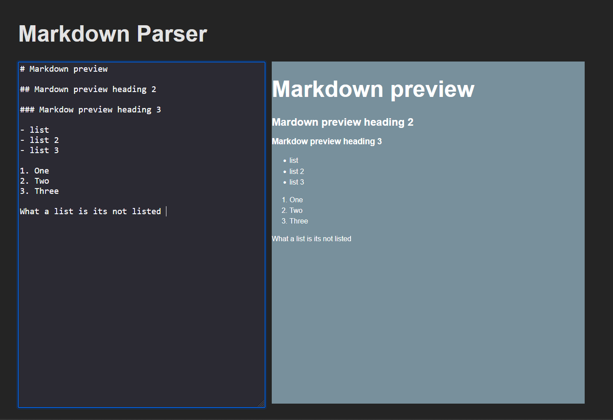

# Markdown Parser (WIP)

Simple Markdown parser in rust which is compiled to `wasm` and presented to browser with `svelte`

### To build just the rust part 
* ` cargo build `
* `wasm-pack build` 

### Run rust tests 
`cargo test`

### To setup frontend 
`cd web` and `yarn`

### To run every thing after compiling to wasm
`cd web` and `yarn dev`

### Currently supports parsing
* unordered lists 
* ordered lists
* simple texts
* Headings (**#**, **##**, **###**)

### Preview 

